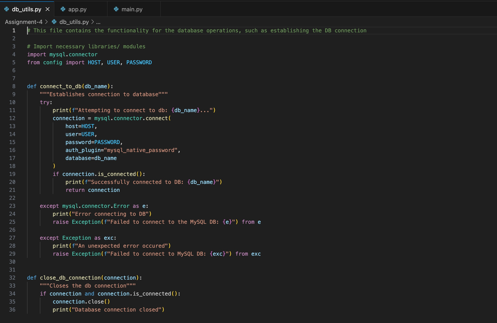

# ASSIGNMENT 4 NOTES, EVIDENCE & EXPLANATION

## Setting Up

In order to interact with the API, there are some pre-requistes that must be completed.

### Required files

Firstly, ensure you have all the necessary files needed to successfully run this program.
These files include:
- `app.py`
- `main.py`
- `db_utils.py`
- `config.py`
- `library_management.sql`
- `requirements.txt`

### Database Credentials

Then, go into the `config.py` file, and edit the `HOST`, `USER` and `PASSWORD` to match your MySQL login details. This provides the authentication that allows us to connect to our database in the MySQL Workbench.

> **Important**: Usually, a `config.py` file should not be pushed to a remote repo because it contains sensitive information that should **never** be shared. The `config.py` file allows us to separate sensitive credentials from the rest of the code but can be loaded into the application when running. If sharing or committing the file, it is imperative that you are cautious and remove any sensitive information before pushing to the remote repo.

> Note: A more reliable way to ensure your credentials never gets pushed is to use a `.env` file instead. This stores your credentials as environment variables and should be added to the `.gitignore` file to prevent it from being pushed. Unlike .py files, which typically contain code and are tracked, .env files can be excluded by adding them to `.gitignore`.

### Virtual Environments

Once that is done, it is recommened you create a new virtual environment (venv) for this folder to isolate the dependencies. 

1. Open your terminal, and navigate to the folder/directory where you wish to set up this venv. You can do this by typing into your terminal:  
`cd /path/to/your/projectfolder`

2. Create the venv (you can name your venv whatever you like): 
Windows: `python -m venv api-venv` 
MacOS: `python3 -m venv api-venv`

3. Activate the venv:  
Windows: `api-venv\Scripts\activate` 
MacOS: `source api-venv/bin/activate`

You know you are successfully using the virtual environment if you terminal prompt displays the venv name e.g. `(api-venv)`

### Install Dependencies

The next step is to install the dependencies by running in your terminal (pip3 if on MacOS):  
`pip install -r requirements.txt`

The virtual environments allow us to install different versions of libraries and modules across different projects, ensuring each project has its own isolated environment which helps with compatibility and debugging.

The dependencies for this project are:
- **Requests**: This handles HTTP requests which will be crucial for our API calls.
- **Flask**: Allows us to create a web app/server for our API.
- **MySQL Connector**: Allows interaction with MySQL databases from Python.

 

## Assignment Aims

My goal was to develop a simple library system to track members, books, and borrowed book records. The database was created and stored in MySQL. 

The system should allow the user to view all library members, available books, and borrowing records. Users can also add new books and record new borrowings.

 

# Process Breakdown

## MySQL Database

First, I created my database.

#### Tables

- **Members**: 
    - Unique `member_id` number (primary key) for each member that auto increments.
    - `first_name` and `last_name` of the members set not `NOT NULL` so we always have a valid full record and prevent errors.
    - `email` is also set to `NOT NULL` and `UNIQUE` to ensure emails are distinct, so no two members could sign up with the same email.
- **Books**:
    - Unique `book_id` number (primary key) for each book that auto increments.
    - `title`, `author` and `genre` of the book set to `VARCHAR` and `NOT NULL`.
    - `year_published` is set to only accept datatype `YEAR`.
- **Borrowed Books**:
    - Unique `borrowed_id` number (primary key) for each booking created that auto increments.
    - `book_id` and `member_id` are foreign keys that reference the parent primary keys from the `members` and `books` table.
    - `borrow_date` records the date in format YYYY-MM-DD.
    - `return_date` is set to `DEFAULT NULL` and can be later updated when the book is returned.
    - The foreign keys are set to `ON DELETE SET NULL` to ensure that when a record in the parent table is deleted, the corresponding foreign key values in this table are automatically set to `NULL`. This preserves the child data records while preventing them from pointing to a non-existent parent row. This helps promote data integrity and reduces the need for manual table updates.

At the end of the script, I executed simple `SELECT * FROM` statements to view my newly created tables.

 

## Running the Code

### Database Connection

I started by setting up my connection to the `library_management.sql` database using Python in my `db_utils.py` file. This is where all database-related operations would be kept.

**Lines 3-5**: I imported the relevant libraires and modules. In this case, `mysql.connector` and my credentials from my `config.py` file.

I created two functions:
- `connect_to_db(db_name)` which establishes the connection and takes the `db_name` as a parameter.
- `close_db_connection(connection)` which closes the existing connection.

Both functions include exception handling to handle any errors during the process. I added print statements within the `try-except` blocks to provide updates on the connection status. In the `except` blocks, the appropriate error messages and print statements are raised to help the user identify the issue.

The `close_db_connection()` function uses an `if` statement to check whether the connection is active before attempting to close it. If successful, a print statement confirms it was closed.

 

## Flask App Creation

The main functionality of the flask app is defined in `app.py`. I imported the relevant functions, variables and class objects from flask ton keep imports minimal. I also imported my database connection functions from `db_utils` to facilitate connection establishment in my flask app.

**Line 5**: `app = Flask(__name__)` initialises an instance of the Flask class using `__name__` to determine the path of the application. It is assigned to the variable `app` which is the main entry point for the web app. In the script, `app` is used to define the web app routes, manage configurations (such as `debug=True`) and run our application.

 

**Lines 7-18**: This section creates the 'home base' route via the `@app.route` decorator which confirms to users that the system is up and running.

Initially, I didn't wrap this code block in a `try-except` block. However, I ran into an issue where the ("/") endpoint would display the message that I was connected, but requests to the other endpoints resulted in errors. 

After investigating these errors, I realised it was because MySQL server was not actually running. To resolve this, I executed this comman in my terminal:   `sudo /usr/local/mysql/support-files/mysql.server start`

Then I made sure to update the health check endpoint to include a `try-except` block, ensuring proper error handling.

 

### GET Method

The `get_all_books()` `get_members()` and `get_borrowed_books()` functions all use the `GET` request method so the process of writing the code was very similar.

In the `try` section of the `try-except` block, I try to establish the connection to the database. When applying the cursor to the `db_connection`, I specified `dictionary=True` to ensure the responses were returned as a dictionaries. After successfully connecting, a print statement notifies the user of the successful connection.

> Note: Before I knew of this parameter, I had to manually create lists/dictionaries to manage the output. However, by using this parameter, I was able to reduce the lines of code while achieving the same results.

The `query` variable handles the SQL query that will manipulate the database. After the query is executed, the function fetches the information, closes the cursor and the information is returned in JSON format with a `200` status code.

The `except` blocks handle any errors that may occur with a message to the user and status code `500 Internal Server Error`. The `finally` block always executes, ensuring the `close_db_connection()` function is called. If the connection is still active, it will be closed and a message will follow to notify the user.

### POST Method

The other two functions I created: `add_new_book()` and `add_new_borrowed()` use the decorator to access the `/books` and `/borrowedbooks` endpoints respectively, and assigns the request method as `POST` which will create new resources.

First the code attempts to read the JSON data from the incoming request using `request.json`. The values for `title`, `author`, `genre` and `year_published` are extracted. In **lines 57 to 58** and **lines 140 to 141** there is a validation check to identify whether any of the required fields are missing. If so, it returns a JSON response with an error message and `400 Bad Request` status code that signifies a bad request made from the user.

The functions then go on to establishing the database connection, just as we did with the other functions, and ensures any information is returned as dictionaries.

The query involves an SQL `INSERT` statement which allows us to add in the newly obtained values of `title`, `author`, `genre` and `year_published`.

> Note: I intially tried to use f-strings as the placeholders but after doing some research, I realised that was the incorrect syntax to use. Using f-strings promotes something called _SQL injection_ which occurs when the user input is inserted directly into the SQL query/command without proper validation/ sanitisation. This poses a risk, especially when working with sensitive information, as the user may manipulate the query and potentially access information they are not supposed to.  

Instead, I utilised the `%s` placeholders for the values where the input is treated as data rather than executable code.

The cursor is then executed with the tuple of values extracted from request. `db_connection.commit()` saves the changes to the database, the cursor is closed and a message is returned to notify the user with a `201 Created` status code.

The `except` block handles any exceptions that arise during the execution of the `try` block, returning a JSON response with the error code `500`. The `finally` block, like before, checks if there is an active connection, then proceeds to close it.

Finally, in **lines 165 to 166**, the `app.py` script is run in the terminal. The argument `debug=True` means the server will automatically reload if any changes are made in the script, and will provide error messages in the browser to help resolve any issues.

## Client-side API Interaction

My `main.py` focuses on the client-side interaction with the API in the console. It is important to note that the `app.py`, and thus, the server, must be running in order for this file to execute as expected.

Firstly, `requests` is imported to deal handle the clients HTTP requests to the Flask API. `datetime` from `datetime` is imported to handle adata format validation.

The `base_url` variable hosts the API link for easier use later in the script. 

The `welcome()` and `actions()` functions are what the user sees when the script is run. It informs them on how the actions they can perform with the API - view members, books and borrowed books, and add new books and new borrowed books.

Expected output:

In the screenshot above, you can also see the expected output when the user interacts with the client-side functions. 
All the functions have a similar structure.

The `GET` functions (`view_books()`, `view_members()` and `view_borrowed()`) send a HTTP GET reequest to their respective API endpoints to retrieve the stored information. If the status code is 200 (OK), then the information is displayed in a easily readable format to the user by using a `for` loop. If not, an error message with the error code and response text is printed. This makes it easier for the user to know what went wrong. Then, the `except` block catches any exceptions raised during the process, for example connection issues, and prints an error message.

The `POST` functions (`add_book()` and `add_borrowed`) uses an `input()` from the user to gather information to add to the respective database tables. The POST request is sent as a JSON object to their endpoints to add the new data. Similar to before, the status code of the response is checked. If it is 201 (Created), then a success message is printed; otherwise, an error is thrown. Once again, similar to the other functions, any exceptions are caught and displayed.

> Note: I created a `valid_date()` function to validate the users input for the `borrow_date` in the `add_borrowed()` function. This is because during testing, I reaised it allowed me to add '6-5-5' as a date, which is invalid. So, this function ensures the date is in the correct format before continuing.
  
 
I used the `strptime()` function to handle all aspects of date format validation including the length of the input, the date ranges and so on.

 

`run()` is the main function that presents the `welcome()` and `actions()` menus to the user, prompts for their choice, then runs the relevant function based on their choice.

`if __name__ == "__main__"` ensures that the `run()` function is called only when the script is executed directly, not when imported as a module.

 

## Demonstration

I will now include some screenshots of what the API should look like on your side, and demonstrate adding in new data to the database.

This is a screenshot of the `/books` endpoint with the information inserted after creating the tables in MySQL Workbench.

After running, `main.py()`, I interact with the API by choosing option 2 to add a new book. It tells me it was successfully added. So, I choose option 1 to view books, and it prints them, confirming my book has been added to the database.

These changes can be seen on the wep app, as well as in MySQL Workbench.
Try it for yourself!